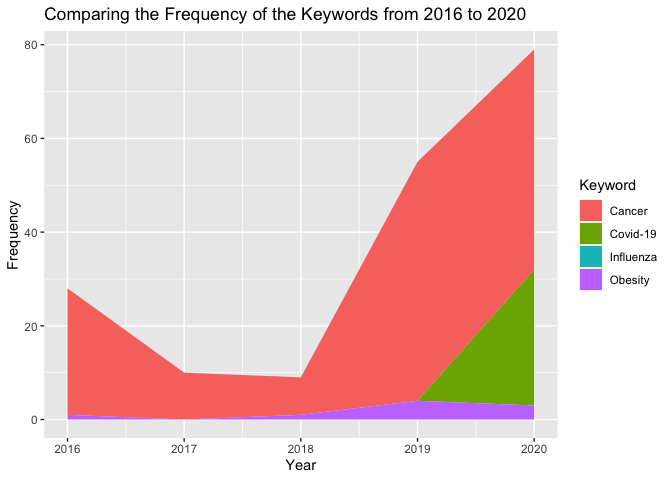
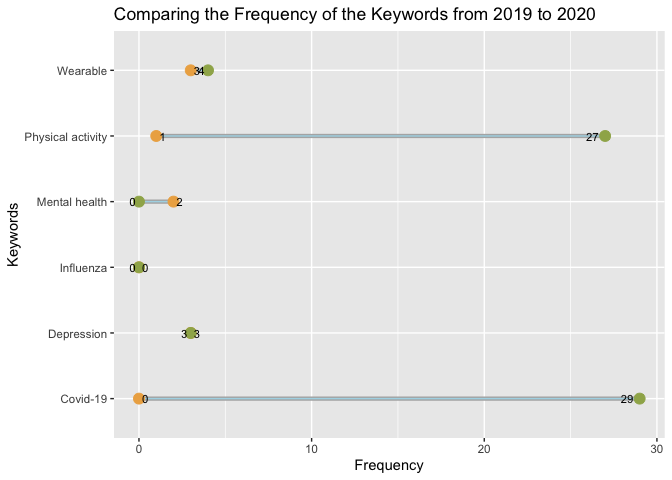

Program to download 5year of articles and find the Keywords
================

### Required Libraries

``` r
library(devtools)
```

    ## Loading required package: usethis

``` r
library(easyPubMed)
library(stringr)

#to disable the global warnings
options(warn = -1)
```

### Keywords to be searched in the article

We are going to search from 2016-2020 for Keyword 1 and 2019 -2020 for
Keyword 2

``` r
keywords1 <- list("Influenza", "Obesity", "Cancer", "Covid-19")
keywords2 <- list("Influenza", "Covid-19", "Depression", "Mental health", "Physical activity", "Wearable")
```

``` r
#year of publication based on which article is searched
my_query <- list('"2016"[PDAT]','"2017"[PDAT]','"2018"[PDAT]','"2019"[PDAT]','"2020"[PDAT]')
```

### Program to search for Keywords in Pubmed

Inorder for the ease for doing all keyword(Keywords1 + Keyword2) will be
searched from 2016 and 2020 and stored in an array

``` r
library(devtools)
library(easyPubMed)
library(stringr)

#to disable the global warnings
options(warn = -1)

#keywords to be searched in the article
keywords1 <- list("Influenza", "Obesity", "Cancer", "Covid-19")
keywords2 <- list("Influenza", "Covid-19", "Depression", "Mental health", "Physical activity", "Wearable")

#year of publication based on which article is searched
my_query <- list('"2016"[PDAT]','"2017"[PDAT]','"2018"[PDAT]','"2019"[PDAT]','"2020"[PDAT]')

#to store the count of occurrence of the keywords
keywordcount1 <- c()
keywordcount2 <- c()

for (query in my_query){
  # Query pubmed and fetch many results
  query <- get_pubmed_ids(query)
  
  # Fetch data
  abstracts_xml <- fetch_pubmed_data(query)  
  
  # Store PubMed Records as elements of a list of particular year
  all_xml <- articles_to_list(abstracts_xml)
  
  #Contains random list of articles
  #To maintain same length of records for each year
  all_xml <- all_xml[0:140]

  # Perform operation (use lapply here)
  #Dataframe with list of articles
  df <- do.call(rbind, lapply(all_xml, article_to_df,max_chars = -1, getAuthors = FALSE))
  
  #Finding the occurrence of keyword in this list keywords1 <- list("Influenza", "Obesity", "Cancer", "Covid-19")
  for (word in keywords1){
      keywordcount1<- append(keywordcount1,sum(str_count(df, regex(word, ignore_case = TRUE))))
  }
  
  #Finding the occurrence of keyword in this list keywords2 <- list("Influenza", "Covid-19", "Depression", "Mental health", "Physical activity", "Wearable")
  temp <- c()
  for (word in keywords2){
      temp<- append(temp,sum(str_count(df, regex(word, ignore_case = TRUE))))
  }
  keywordcount2 <- append(keywordcount2,list(temp))
}

#keywords2 of 2019 and 2020
keywordcount2 <- keywordcount2[4:5]
```

#### For each of the following terms: Influenza, Obesity, Cancer, Covid-19 create an area chart and compare their frequencies for each of the following years: 2016, 2017, 2018, 2019, 2020.

``` r
#required libraries
library("ggplot2") 
library("ggthemes") 
library("extrafont") 
```

    ## Registering fonts with R

``` r
library("plyr")

#Preparing the dataset
year <- c(2016,2016,2016,2016,2017,2017,2017,2017,2018,2018,2018,2018,2019,2019,2019,2019,2020,2020,2020,2020)
keywords1 <- list("Influenza", "Obesity", "Cancer", "Covid-19")
keywords1 <- rep(unlist(keywords1),5)

#Plotting the areachart
plot1 <- ggplot()+geom_area(aes(y = keywordcount1, x = year, fill = keywords1), 
                           stat="identity")+labs(title = "Comparing the Frequency of the Keywords from 2016 to 2020",x = "Year",y = "Frequency",fill = "Keyword")
plot1
```

<!-- -->

#### Using a dumbbell-chart and report the changes in following keywords for 2020 and 2019: Influenza, Covid-19, Depression, Mental health, Physical activity, Wearable

``` r
#required libraries
library(ggalt)
```

    ## Registered S3 methods overwritten by 'ggalt':
    ##   method                  from   
    ##   grid.draw.absoluteGrob  ggplot2
    ##   grobHeight.absoluteGrob ggplot2
    ##   grobWidth.absoluteGrob  ggplot2
    ##   grobX.absoluteGrob      ggplot2
    ##   grobY.absoluteGrob      ggplot2

``` r
#Creating a DataFrame for Dumbell Plot
df <- data.frame(keyword = c("Influenza", "Covid-19", "Depression", "Mental health", "Physical activity", "Wearable"),col1 = unlist(keywordcount2[1]),col2= unlist(keywordcount2[2]))

#Dumbell Plot with functions to see the Frequency
ggplot(df,aes(x=col1, xend=col2, y=keyword)) + geom_dumbbell()+geom_segment(aes(x=col1, xend=col2,y=keyword,yend=keyword),color="#b2b2b2", size=1.5)+geom_dumbbell(color="light blue", 
                size_x=3.5, 
                size_xend = 3.5,
                #Note: there is no US:'color' for UK:'colour' 
                # in geom_dumbbel unlike standard geoms in ggplot()
                colour_x="#edae52", 
                colour_xend = "#9fb059")+labs(title = "Comparing the Frequency of the Keywords from 2019 to 2020",x = "Frequency",y = "Keywords")+geom_text(color="black", size=3, hjust=-0.5,
            aes(x=col1, label=col1))+
  geom_text(aes(x=col2, label=col2), 
            color="black", size=3, hjust=1.5)
```

<!-- -->
